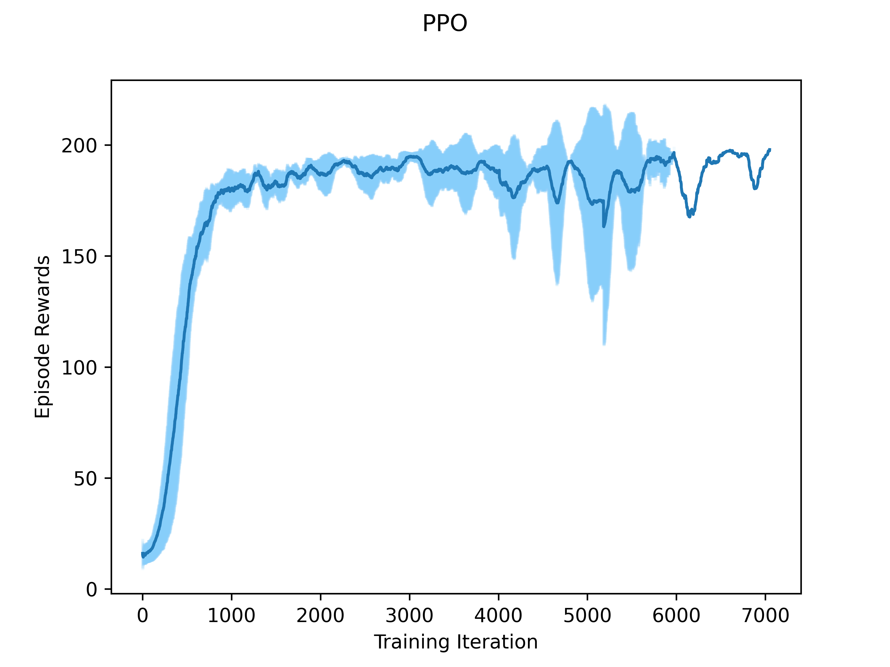
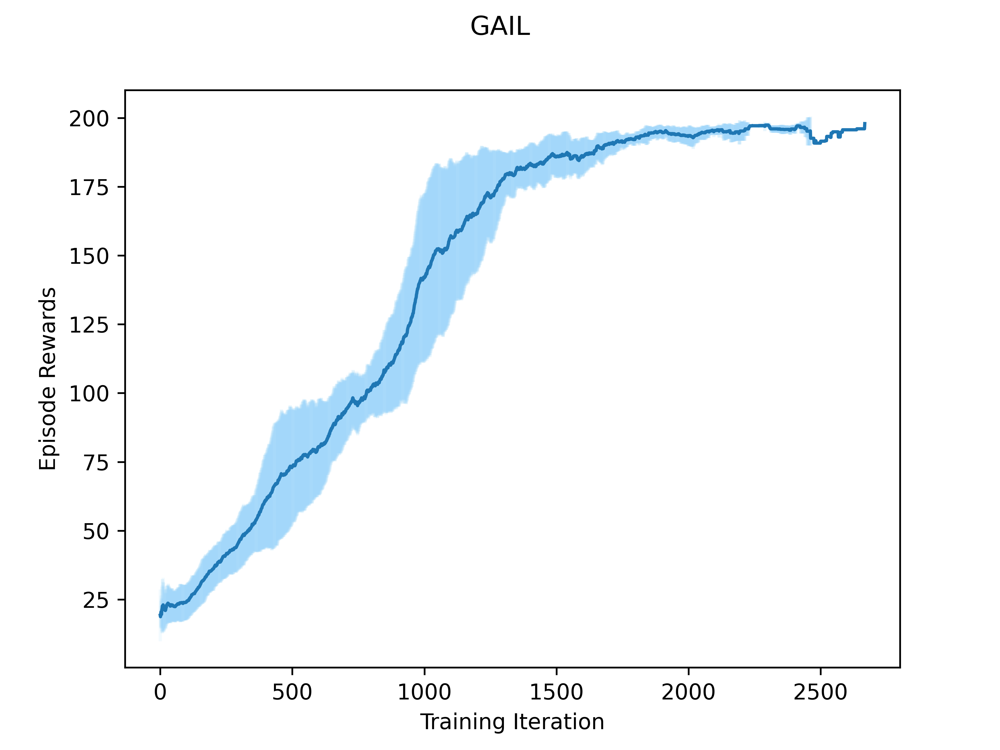

# Generative Adversarial Imitation Learning

PyTorch implementation of the paper:

Ho, Jonathan, and Stefano Ermon. "[Generative adversarial imitation learning.](https://arxiv.org/pdf/1606.03476.pdf)" Proceedings of the 30th International Conference on Neural Information Processing Systems. 2016.

We also present a [report](report.pdf) with theoretical and empirical studies based on our understanding of the paper and other related works. 
## Installation
```commandline
pip install -r requirements.txt
pip install -e .

[optional] conda install swig
[optional] pip install box2d-py
```

Note: ```swig``` and ```box2d-py``` are required only by ```LunarLander-v2``` environment.

## Run Setup

Have a look at the parameters set in the corresponding run config files before executing these commands. We provide some 
example pretrained models and sampled expert trajectories to directly work with as well.

### Train PPO to learn expert policy

```shell script
python ppo.py --config config/CartPole-v0/config_ppo.json
```

### Sample expert trajectories

```shell script
python traj.py --config config/CartPole-v0/config_traj.json
```

### Train GAIL for imitation learning

```shell script
python main.py --config config/CartPole-v0/config_gail.json
```

### Generate training graphs

```shell script
python visualize.py --env_id CartPole-v0 --out_dir ../pretrained --model_name ppo
python visualize.py --env_id CartPole-v0 --out_dir ../pretrained --model_name gail
```

## Cartpole-v0 Experiment



## References

1. [GitHub: nav74neet/gail_gym](https://github.com/nav74neet/gail_gym)
2. [GitHub: nikhilbarhate99/PPO-PyTorch](https://github.com/nikhilbarhate99/PPO-PyTorch)
3. [Medium: Article on GAIL](https://medium.com/@sanketgujar95/generative-adversarial-imitation-learning-266f45634e60)
4. [Blog post on PPO algorithm](https://towardsdatascience.com/proximal-policy-optimization-tutorial-part-1-actor-critic-method-d53f9afffbf6)
5. [White Paper on MCE IRL](https://apps.dtic.mil/sti/pdfs/AD1090741.pdf)

## Acknowledgements

This work has been completed as a course project for [CS498: Reinforcement Learning](https://nanjiang.cs.illinois.edu/cs498/) 
course taught by [Professor Nan Jiang](https://nanjiang.cs.illinois.edu/). I thank our instructor and course teaching 
assistants for their guidance and support throughout the course.

## Contact

Jatin Arora

University Mail: [jatin2@illinois.edu](mailto:jatin2@illinois.edu)

External Mail: [jatinarora2702@gmail.com](mailto:jatinarora2702@gmail.com)

LinkedIn: [linkedin.com/in/jatinarora2702](https://www.linkedin.com/in/jatinarora2702)
 
